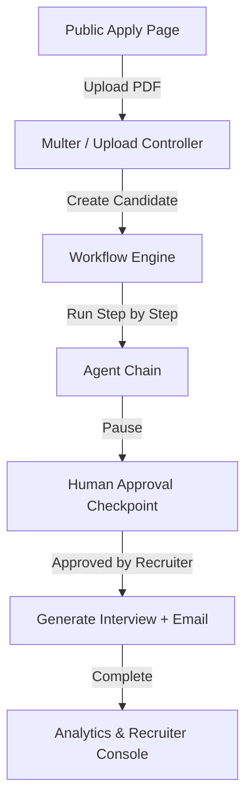

# AgentHire - Spec-Driven Multi-Agent AI Recruitment Platform

AgentHire is a full-stack recruitment workflow orchestration platform. Recruiters can publish job roles, audit candidate suitability, monitor real-time AI agents telemetry using a stateful React Flow canvas, approve/reject applicants at manual review checkpoints, and analyze hiring statistics. Candidates apply through a public portal by uploading their PDF resumes, triggering a stateful LangGraph-inspired orchestrator.

The entire platform is **spec-driven (Spec Driven Development)**: all evaluations, scoring weights, retry policies, prompts, and dashboard colors are loaded from central JSON schemas inside `/specs/` and never hardcoded in the application layers.

---

## Technical Architecture



### Monorepo Structure
- `/specs`: Single source of truth containing JSON configurations (hiring rules, prompts, templates, UI colors).
- `/server`: Node.js, Express, MongoDB (Mongoose), Multer, Zod, and custom stateful workflow engine.
- `/client`: Next.js 15 (App Router), Tailwind CSS v4, Zustand store, and `@xyflow/react` (React Flow).
- `/demo-data/resumes`: Seeded mockup candidate resumes.
- `/scripts`: Bootstrap and seeder helper files.

---

## Folder Schema Map

```
ai-recruitment-platform/
||-- client/              # Next.js 15 app
||-- server/              # Express backend server
||-- specs/               # Central Spec contracts (Source of Truth)
|   |-- hiring/           # Role requirements
|   |-- workflow/         # Node list and node UI colors
|   |-- evaluation/       # RAG parameters and shortlisting rules
|   |-- prompts/          # LLM agent system prompts
|   |-- email/            # Outbound template scripts
|   |-- system/           # Retries and delay policies
||-- demo-data/resumes/   # Sample PDF resumes
||-- scripts/             # Seeding helpers
||-- .env                 # API keys & DB environment variables
||-- .gitignore           # Git ignore directory index
```

---

## 7-Agent Orchestrator Pipeline
The backend runs each applicant resume through the sequential agent nodes defined in `/specs/workflow/default-hiring-workflow.json`:

1. **Resume Parser Agent:** Extracts name, contact details, skills, education, and projects from raw PDF text.
2. **Embedding Agent:** Chunks text and writes vector indices to Qdrant (or local memory database fallback).
3. **Matching Agent:** Generates suitability scores programmatically and with LLM comparison using RAG context.
4. **Shortlisting Agent:** Evaluates scores against spec thresholds to assign `shortlisted`, `hold`, or `rejected` status.
5. **Human Approval Checkpoint:** Halts execution and notifies the recruiter console.
6. **Interview Agent:** Dynamically builds 3 custom technical questions, 1 coding assignment, and rubrics.
7. **Email Agent:** Sends tailored interview invitations or rejection notifications via Resend API (or logs mockup text).

---

## Getting Started

### Prerequisites
- Node.js 18+
- MongoDB installed and running locally (`mongodb://127.0.0.1:27017`)
- *(Optional)* Qdrant server, Groq API Key, and Resend API Key.

### 1. Installation
Install all dependencies for the workspace, client, and server:
```bash
npm install
npm run install-all
```

### 2. Configure Environment
Create a `.env` file at the root:
```env
PORT=5000
MONGODB_URI=mongodb://127.0.0.1:27017/agenthire
JWT_SECRET=agenthire_super_secret_jwt_key

# AI integrations (Will default to local mock simulators if empty)
GROQ_API_KEY=
OPENROUTER_API_KEY=
QDRANT_URL=http://localhost:6333
RESEND_API_KEY=

# Client settings
NEXT_PUBLIC_API_URL=http://localhost:5000/api
```

### 3. Bootstrap & Seed Database
Build sample PDF resumes and seed the database with a default job listing and recruiter profile:
```bash
# Generate sample PDFs
node scripts/seed-resumes.js

# Seed database and retrieve test link
npm run seed --prefix server
```
*Note: Seeding outputs a test candidate application link (e.g. `http://localhost:3000/jobs/<job-id>/apply`) and Recruiter Console credentials (`recruiter@example.com` / `password123`).*

---

## Running the Platform

To launch both the Next.js client and Express backend concurrently:
```bash
npm run dev
```

- **Frontend Console:** [http://localhost:3000](http://localhost:3000)
- **Backend API Server:** [http://localhost:5000](http://localhost:5000)

---

## Running Integration Tests
To execute API endpoint testing (Authentication, Jobs, Candidates):
```bash
npm run test --prefix server
```

---

## Cloud Deployment

AgentHire is configured for modern multi-service cloud hosting:

### 1. Backend Server (Render Blueprint)
* Deployed on **Render** using the Blueprint configuration in the root directory.
* Go to your **Render Dashboard**, click **New** -> **Blueprint**, and select this repository.
* Enter your environment variable values securely when prompted:
  * `MONGODB_URI`: Your MongoDB Atlas cloud connection URI.
  * `JWT_SECRET`: A secure custom string for token validation.
* Once the build completes and is marked **Live**, copy your backend service URL.

### 2. Frontend Client (Vercel)
* Deployed on **Vercel** with automatic Next.js configurations.
* Import the repository to Vercel, set the **Root Directory** to `client`, and configure the following environment variable:
  * `NEXT_PUBLIC_API_URL`: `https://<YOUR-RENDER-URL>/api` (e.g. `https://agenthire-backend.onrender.com/api`).
* Click **Deploy** to publish the recruiter and application portals.

